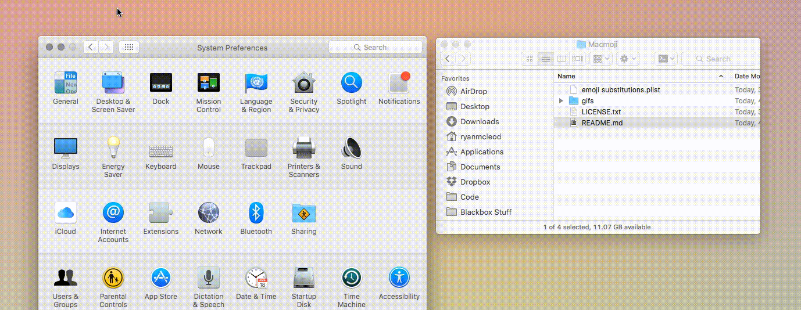

# Greek substitutions for macOS

Basically you type :alpha: and it is substituted to α, type :alphau: and it is substituted to Α.

Upper case letters are differed by adding an "u" in the end.
This approach choosed is because test substitution in macOS is case-insensitive.

# Install

Here I'll just stole the gif from [Macmoji](https://github.com/warpling/Macmoji):

